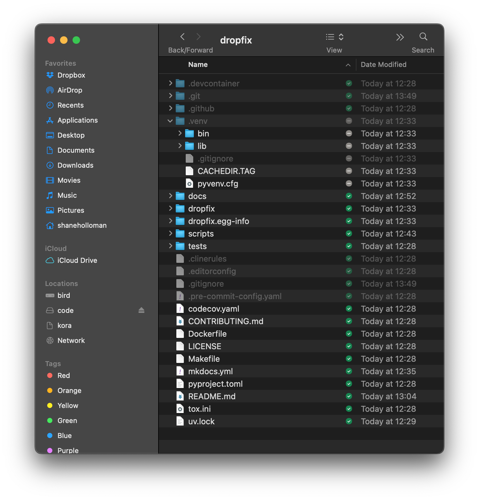

# `dropfix`

> [!TIP]
> Dropbox Directory Ignore Tools

dropfix helps you configure Dropbox to ignore specific development directories (`.venv`, `.conda`, `node_modules`) that don't need to be synced across machines.

> [!NOTE]
> This package isn't published yet, but will soon be installable with: `uv tool install dropfix`
> after which you can simply run `dropfix` from anywhere.



## Quick Start

### All Operating Systems

Run the Python script directly (works on Windows, macOS, and Linux):

```bash
# Check which directories are ignored (auto-detects Dropbox path)
uv run dropfix/dropfix-check.py

# Basic usage (auto-detects Dropbox path)
python dropfix/dropfix.py

# Dry run mode (shows what would happen without making changes)
python dropfix/dropfix.py --dry-run

# Specify custom Dropbox path
python dropfix/dropfix.py --path /path/to/your/Dropbox

# Ignore specific directories
python dropfix/dropfix.py --dirs .venv .cache node_modules
```

Check which directories are being ignored:

```bash
# Check which directories are ignored (auto-detects Dropbox path)
python dropfix/dropfix-check.py

# Show only ignored directories
python dropfix/dropfix-check.py --show ignored

# Show only not-ignored directories
python dropfix/dropfix-check.py --show not-ignored
```

### Platform-Specific Shell Scripts

Alternatively, you can use the platform-specific scripts in the `scripts/` directory:

- **Windows**: Run `scripts/dropfix-win.ps1` in PowerShell
- **Linux**: Run `scripts/dropfix-nix.sh` in Bash
- **macOS**: Run `scripts/dropfix-mac.sh` in Terminal

### Python Module Usage

If you install the package or run from the repo:

```bash
# Using Python module syntax
python -m dropfix.dropfix
python -m dropfix.dropfix-check
```

## Why These Tools?

- **Save Space**: Avoid syncing large development directories
- **Improve Performance**: Reduce Dropbox sync operations
- **Cross-Platform Compatible**: Works across different operating systems

## Cross-Platform Safety

These scripts set the same `com.dropbox.ignored` attribute (with value `1`) that Dropbox recognizes across all platforms:

- Windows uses NTFS alternate data streams
- macOS uses extended attributes
- Linux uses file attributes

You can safely use Windows machines, macOS, and Linux with the same Dropbox account without conflicts.

## Advanced Configuration

For additional ways to configure Dropbox ignore patterns, including:

- Using `.dropboxignore` (Business accounts)
- Setting sync exclusion lists
- Manual command-line operations

See the [Advanced Dropbox Ignore Tools](./docs/db-ignore.md).

## After Running Scripts

Remember to restart Dropbox for the changes to take effect.

## Note About Paths

The scripts in the `scripts/` directory include hardcoded paths (`C:\Users\shane\Dropbox` for Windows and `$HOME/Dropbox` for macOS/Linux) for convenience. Before running, you may need to:

1. Open the script in a text editor
2. Change the `$dropboxPath` variable to match your Dropbox location
3. Save the file

The scripts were originally created for personal use, so these paths were hardcoded to bypass additional configuration questions.
