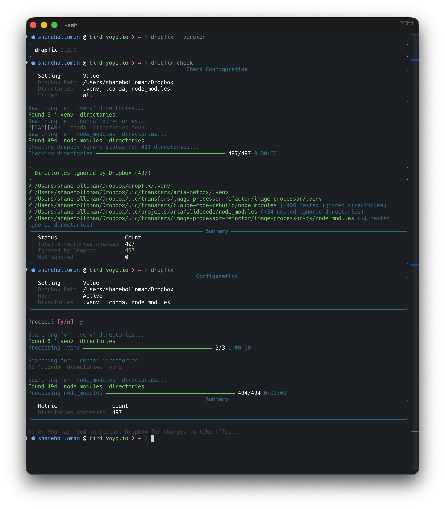
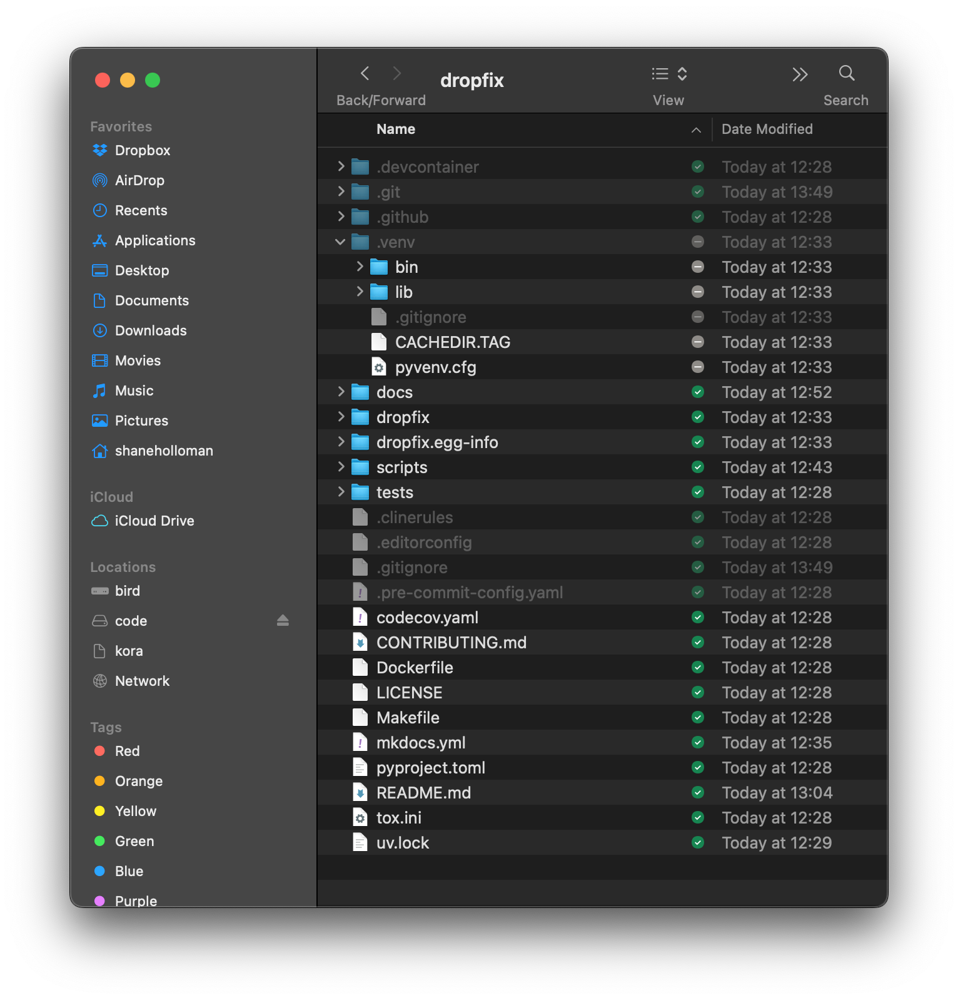

# `dropfix`

> [!TIP]
> Dropbox Directory Ignore Tools

dropfix helps you configure Dropbox to ignore specific development directories (`.venv`, `.conda`, `node_modules`) that don't need to be synced across machines.





## Installation

```bash
uv tool install dropfix
```

## Usage

### Ignore directories

```bash
# Basic usage (auto-detects Dropbox path and ignores common directories)
dropfix

# Dry run mode (shows what would happen without making changes)
dropfix --dry-run

# Specify custom Dropbox path
dropfix --path /path/to/your/Dropbox

# Ignore specific directories
dropfix --dirs .venv .cache node_modules

# Skip confirmation prompt
dropfix --yes
```

### Check which directories are ignored

```bash
# Check which directories are ignored (auto-detects Dropbox path)
dropfix check

# Show only ignored directories
dropfix check --show ignored

# Show only not-ignored directories
dropfix check --show not-ignored

# Check specific directories
dropfix check --dirs .venv .conda
```

### Other options

```bash
# Show version
dropfix --version

# Show help
dropfix --help

# Verbose logging (use -v for INFO, -vv for DEBUG)
dropfix -v --dry-run
dropfix check -vv
```

## Why These Tools?

- **Save Space**: Avoid syncing large development directories
- **Improve Performance**: Reduce Dropbox sync operations
- **Cross-Platform Compatible**: Works across different operating systems

## Cross-Platform Safety

These scripts set the same `com.dropbox.ignored` attribute (with value `1`) that Dropbox recognizes across all platforms:

- Windows uses NTFS alternate data streams
- macOS uses extended attributes
- Linux uses file attributes

You can safely use Windows machines, macOS, and Linux with the same Dropbox account without conflicts.

## After Running

Remember to restart Dropbox for the changes to take effect.
