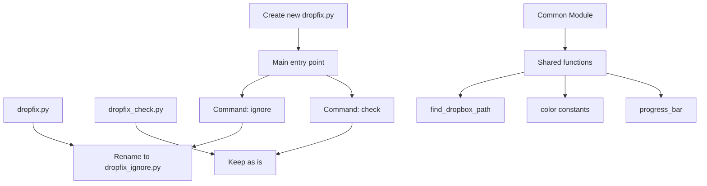

# Dropfix Refactoring Plan

## Current Structure Analysis

Both scripts (`dropfix.py` and `dropfix_check.py`) share significant common code:

- Color constants
- Dropbox path detection logic
- OS-specific attribute handling
- Progress bar functionality
- Common argument parsing patterns

However, they serve distinct purposes:

- `dropfix.py`: Sets the `com.dropbox.ignored` attribute on directories
- `dropfix_check.py`: Checks which directories have this attribute set

## Refactoring Plan

### 1. Create Common Module (`dropfix_common.py`)

Extract shared functionality into a common module:

- ANSI color constants
- `find_dropbox_path()` function
- Progress bar implementation
- OS-specific attribute handlers

### 2. Refactor Existing Scripts

#### `dropfix.py` → `dropfix_ignore.py`

- Rename the file
- Import shared functions from common module
- Restructure to allow being imported as a module
- Create a main `ignore_directories()` function that can be called from the new main script

#### `dropfix_check.py`

- Keep the filename
- Import shared functions from common module
- Restructure to allow being imported as a module
- Create a main `check_directories()` function that can be called from the new main script

### 3. Create New Main Entry Point (`dropfix.py`)

Create a new script that:

- Imports functionality from both modules
- Provides a unified CLI interface with subcommands:
  - `python dropfix.py ignore [options]` (maps to dropfix_ignore functionality)
  - `python dropfix.py check [options]` (maps to dropfix_check functionality)
- Maintains all existing options from both scripts
- Uses the argparse subparsers feature to organize commands

### 4. Final Structure

The final structure will be:

- `dropfix.py` - New main entry point
- `dropfix_common.py` - Shared functionality
- `dropfix_ignore.py` - Renamed from original dropfix.py
- `dropfix_check.py` - Existing check script

This structure maintains backward compatibility while providing a unified interface, reduces code duplication, and improves maintainability.
